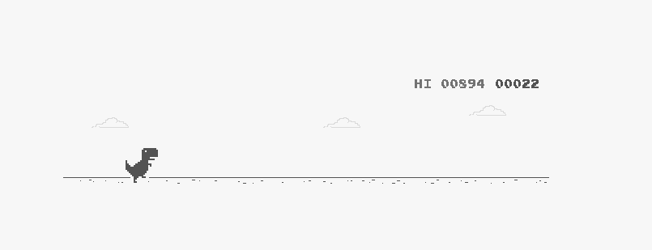

google_dino_game
================

Script that plays the google dino game for you.(
<http://www.trex-game.skipser.com/>)

However, it isn’t a general solution and it’s simply just recognizing when the
color of the cactus or bird appears and jumping. Meaning it won’t work for all
resolutions.

(It will work if you have a 3440x1440 and have the chrome window is half the
screen at 100% zoom)

